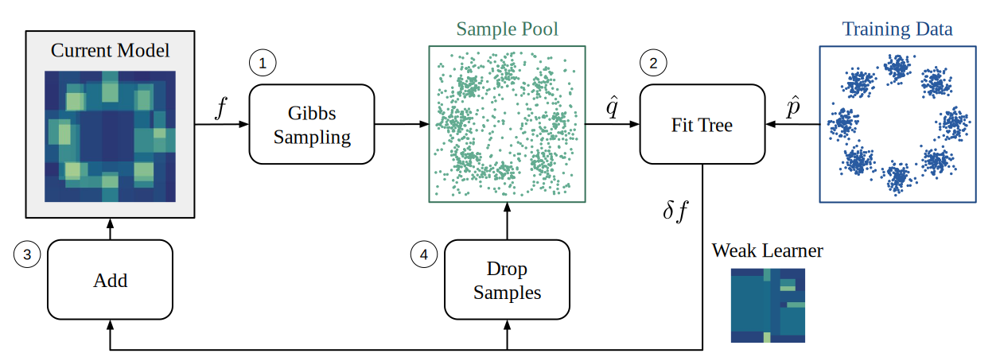

# NRGBoost: Energy-Based Generative Boosted Trees 🔋🌳

This repository contains the official code of the paper [NRGBoost: Energy-Based Generative Boosted Trees](https://arxiv.org/abs/2410.03535) (ICLR 2025).

<div align="center">



<p><i>Overview of an NRGBoost training iteration.</i></p>
</div>

## Installation

To install the latest version of the python package run:

```shell
pip install nrgboost
```

## NRGBoost Models

The following example shows how to train a NRGBoost model on the California Housing dataset:

```python
from sklearn.datasets import fetch_california_housing
from sklearn.model_selection import train_test_split

from nrgboost import Dataset, NRGBooster

# Get data
df, y = fetch_california_housing(return_X_y=True, as_frame=True)
df.insert(0, y.name, y)
df, test_df = train_test_split(df, test_size=0.2, random_state=123)
train_df, val_df = train_test_split(df, test_size=0.2, random_state=124)

# Create training set
train_ds = Dataset(train_df)

# Train model
params = {
    'num_trees': 200,
    'shrinkage': 0.15,
    'max_leaves': 256,
    'max_ratio_in_leaf': 2,
    'num_model_samples': 80_000,
    'p_refresh': 0.1,
    'num_chains': 16,
    'burn_in': 100,
    }
model = NRGBooster.fit(train_ds, params, seed=1984)
```

**Note:** If your dataset contains categorical variables, they should be cast to pandas `Categorical` dtype before calling the `Dataset` constructor. For example `df[categorical_col] = df[categorical_col].astype("category")`.

### Prediction

To use the trained model for prediction we can call the `predict` method. 
This allows the user to specify a column name for prediction. 
Unlike discriminative methods, NRGBoost can be used to predict any column in the data, not just a specific "target" column.

```python
import numpy as np
from sklearn.metrics import r2_score

# Do "early stopping" first:
# find the best boosting round for prediction in validation
# with cumulative=True, predict will return an iterator 
# over predictions at different rounds
preds = model.predict(val_df, y.name, cumulative=True)
val_r2 = [r2_score(val_df[y.name], yh) for yh in preds]
best_round = np.argmax(val_r2) 

#%% Compute test R^2 using only the first `best_round` trees
test_preds = model.predict(test_df, y.name, num_rounds=best_round)
test_r2 = r2_score(test_df[y.name], test_preds)
print('Test R^2:', test_r2)
```

**Note:** For numerical columns, NRGBoost currently predicts the expected value according to it's learned distribution. In the future we plan to make this more flexible so that the user can select a different point estimate (e.g., median or another quantile) or have access to the full distribution.

For categorical columns, NRGBoost will output logits for each possible outcome. The prediction will be an array with shape (N, K) where N is the number of points and K the cardinality of the column. The orders of each logit are determined by the pandas `codes` for each possible value.
By default, the output logits are already normalized so they can be converted to probabilities directly by exponentiation (i.e., no need to apply softmax since their partition function is already set to 1).

### Sampling

To draw 500 samples from the model using only the first `best_round` trees run:

```python
samples_df = model.sample(500, num_steps=100, num_rounds=best_round)
```

`num_steps` is the number of Gibbs sampling steps that are used to generate each individual sample. It allows the user to trade-off computation time (which scales linearly in `num_steps`) for bias in the generated samples.


### Saving and Loading

To save a NRGBoost model run

```python
model.save('filename')
```

The saved model can then be loaded via:
```python
from nrgboost import NRGBooster

model = NRGBooster.load('filename')
```

## Cite NRGBoost

You can cite NRGBoost as:

```latex
@misc{bravo2024nrgboost,
      title={NRGBoost: Energy-Based Generative Boosted Trees}, 
      author={João Bravo},
      year={2024},
      eprint={2410.03535},
      archivePrefix={arXiv},
      primaryClass={cs.LG},
}
```